# Harbourly webapp MVP user flow

The reference script for design and build. Every page we design should map to a node here; anything not here needs agreeing first. Built from the MVP feature list plus `design/DECISIONS.md`.

Diagrams:

1. Map of the whole product
2. Sign up and log in
3. Browse, profile and booking
4. Before the session: reminders, rescheduling, cancelling
5. The session
6. After the session: confirm, review
7. Disputes
8. Coach journey: application to live
9. Live coach: managing the profile
10. Account
11. Booking status lifecycle
12. Coach status lifecycle
13. Navigation and dual-role routing

---

## 1. Map of the whole product

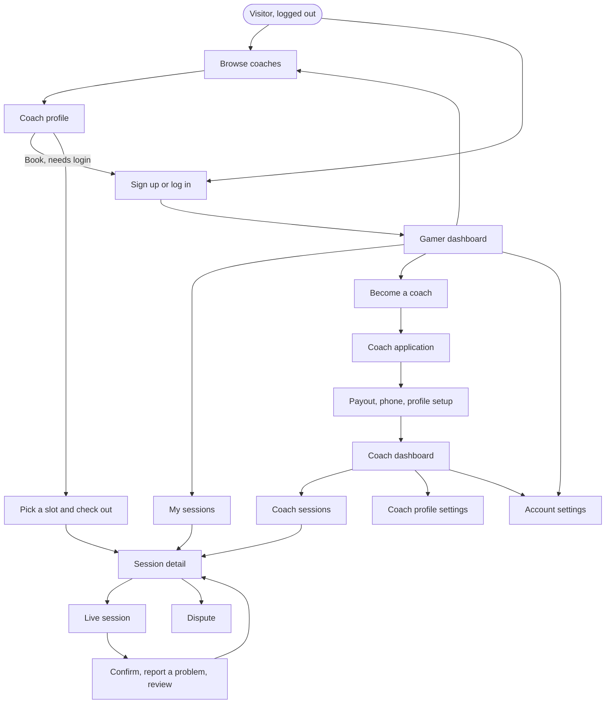

---

## 2. Sign up and log in

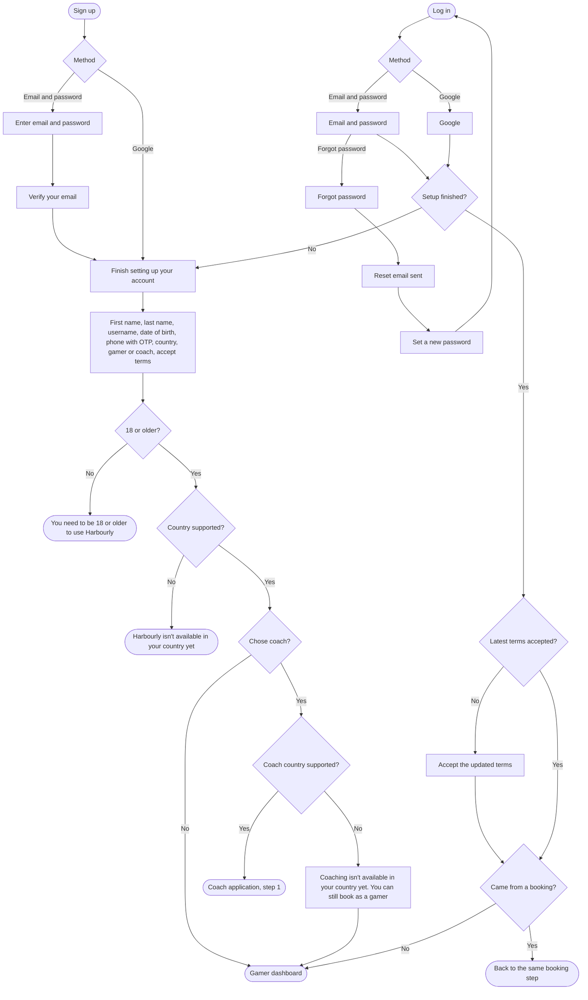

The gamer or coach choice is a routing hint only. Every account can book as a gamer.

---

## 3. Browse, profile and booking

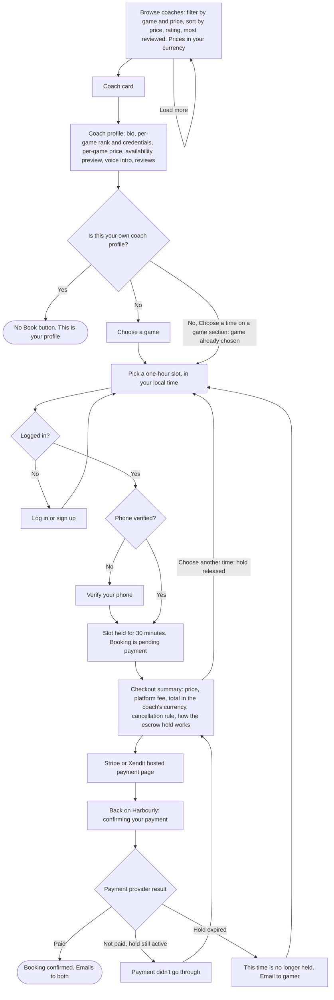

---

## 4. Before the session: reminders, rescheduling, cancelling

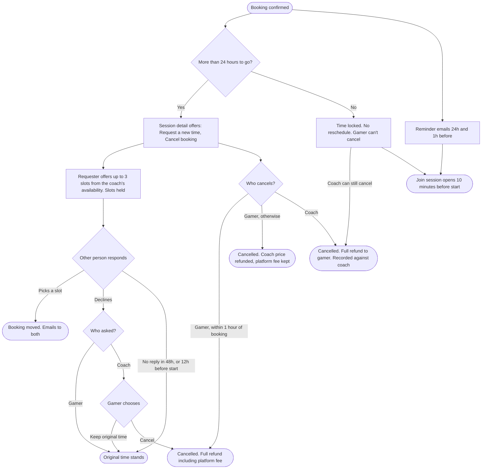

Only one open request per booking, and at most one accepted reschedule per booking. A coach cancelling inside 24 hours counts as a serious incident.

---

## 5. The session

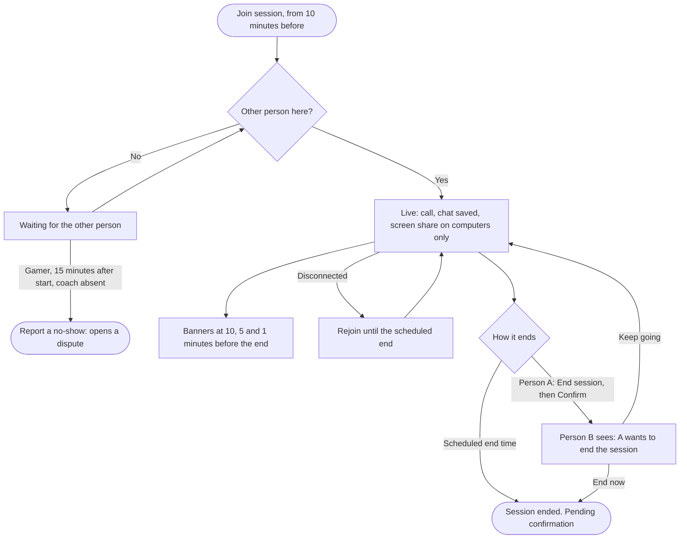

---

## 6. After the session: confirm, review

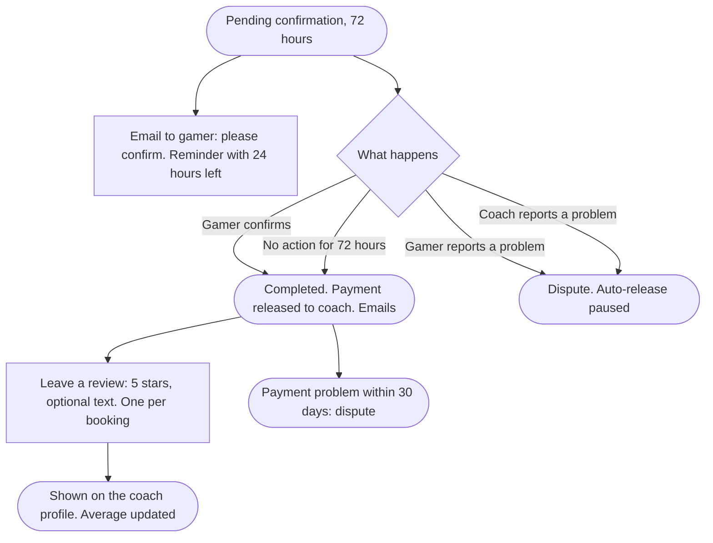

---

## 7. Disputes

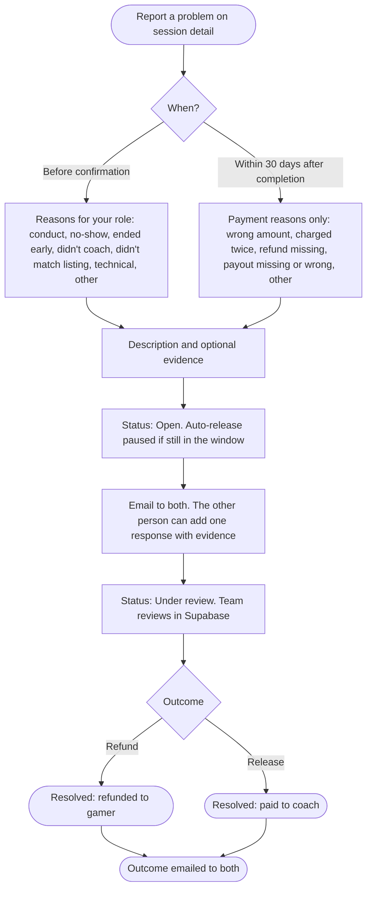

Always a full refund or a full release. Resolution happens in the Stripe or Xendit dashboard.

---

## 8. Coach journey: application to live

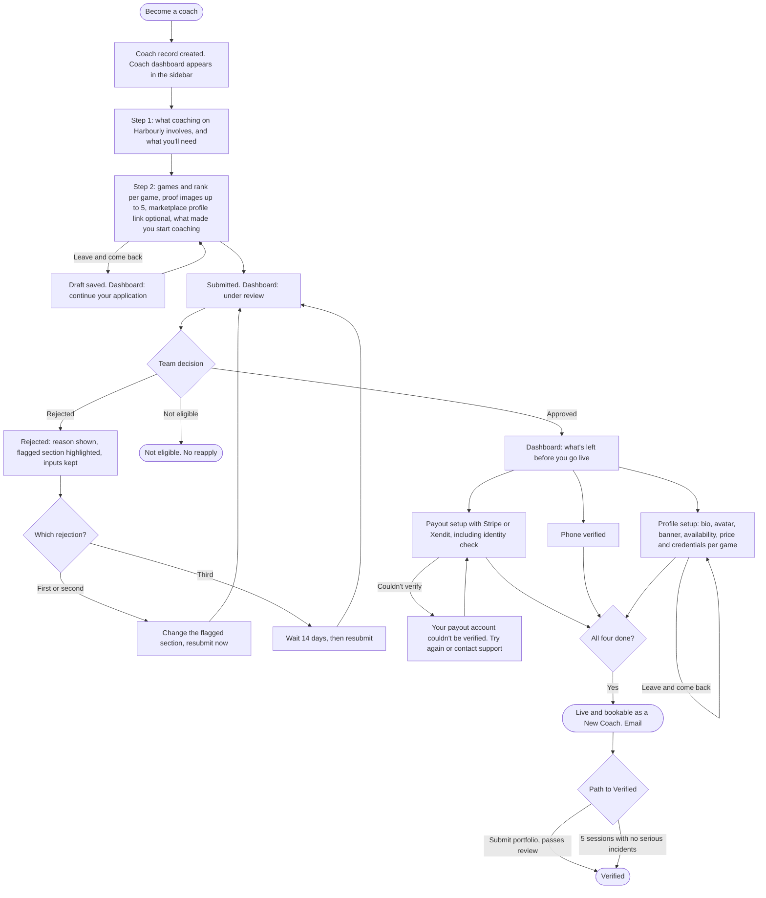

The four conditions to go live: application approved, payout setup complete, phone verified, profile complete.

---

## 9. Live coach: managing the profile

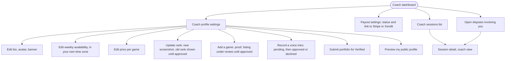

---

## 10. Account

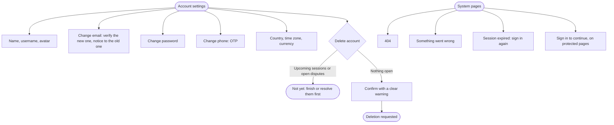

A coach's country can't be changed here once payout setup is done.

---

## 11. Booking status lifecycle

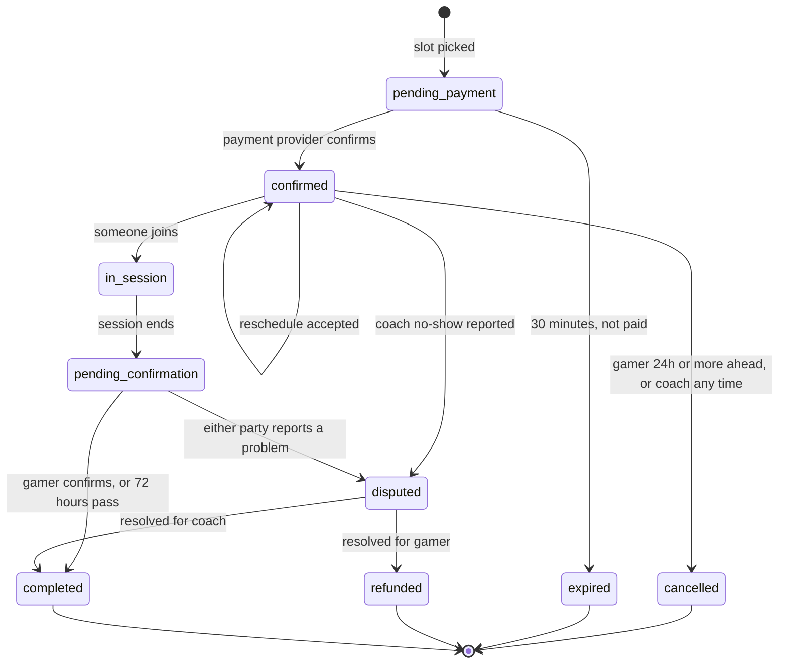

A reschedule request is shown as a second line on a confirmed booking, not a separate status. A payment dispute after completion is tracked on the dispute record, not as a new booking status.

---

## 12. Coach status lifecycle

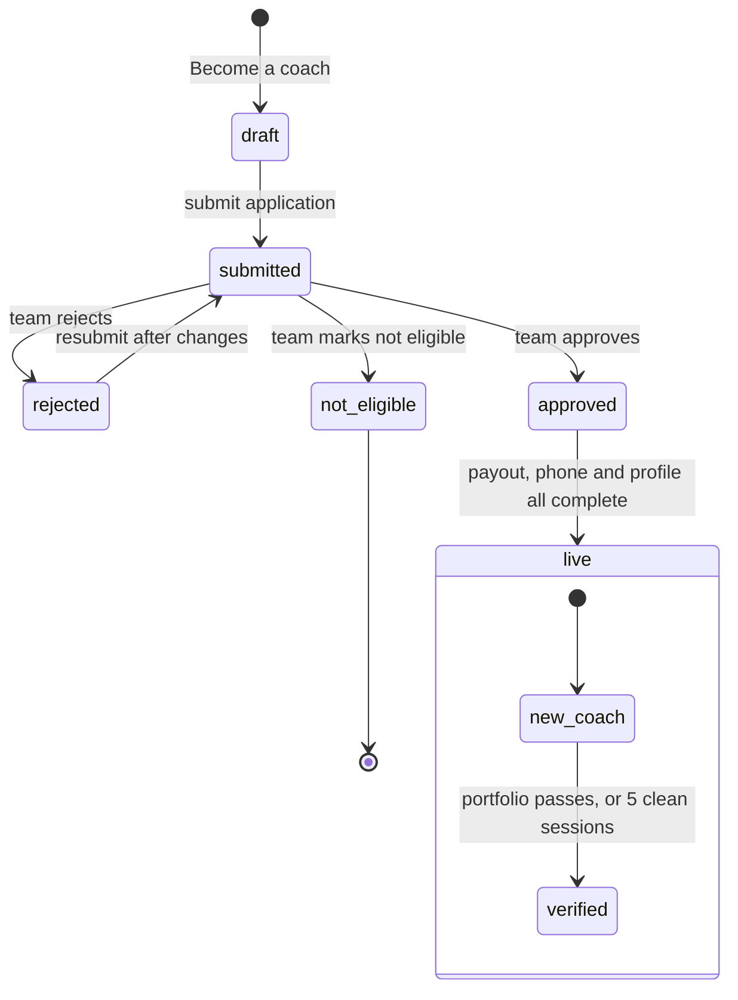

---

## 13. Navigation and dual-role routing

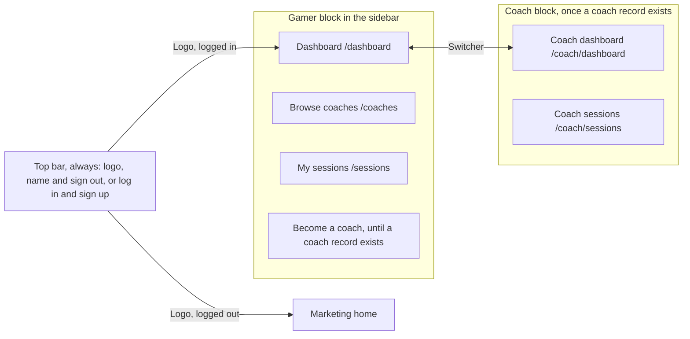

Gamer and coach data never mix. Each dashboard and each sessions list is its own route with its own data.
